# Expense Tracker 💰

## Overview 📖
**Expense Tracker** is a responsive web application designed to help users efficiently track, manage, and visualize their expenses.

## Features 🌟

- **User Authentication** 🔒:
  - Sign up, log in, and log out securely using Firebase Authentication.

- **Expense Management** 💼:
  - Add, edit, and delete expenses.
  - Categorize expenses by category (e.g., food, transport, utilities).
  - View a detailed list of expenses.

- **Budget Tracking** 📊:
  - Set and track monthly budgets.
  - Receive alerts when nearing or exceeding the budget.

- **Expense Visualization** 📈:
  - Visualize expenses with charts (bar, pie, and line).
  - Filter expenses by date or category for detailed analysis.

- **Responsive Design** 📱:
  Works seamlessly on all devices (desktop, tablet, mobile).

## Technologies Used 🛠️
- **Frontend**: HTML, CSS, JavaScript  
- **Backend**: Firebase Realtime Database and Authentication  
- **Hosting**: Firebase Hosting  

## Folder Structure 📂
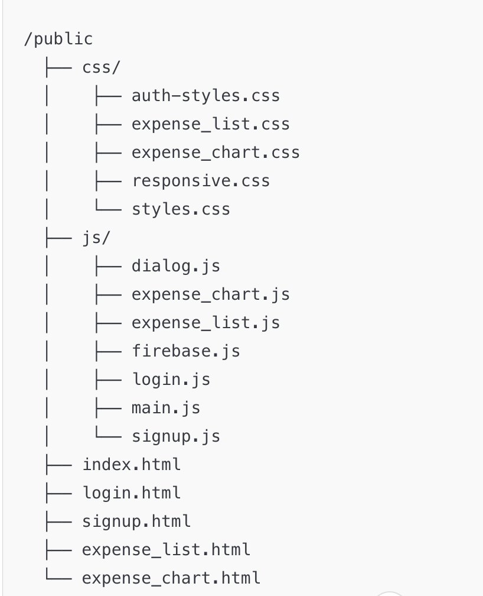

## Screenshots 📸

### Login Page 🔑
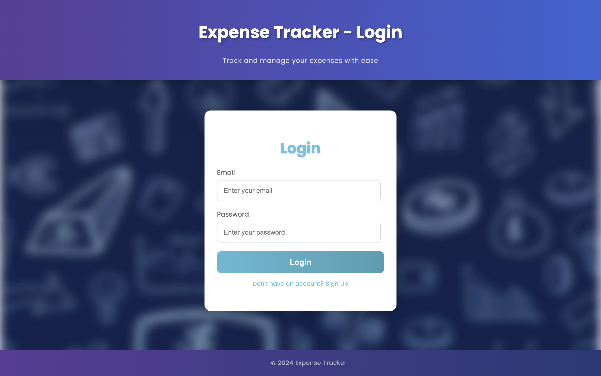

### Sign Up Page 📝
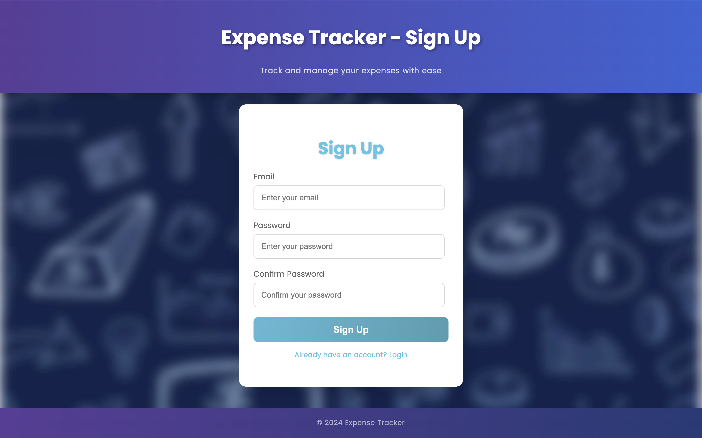

### Dashboard 📊
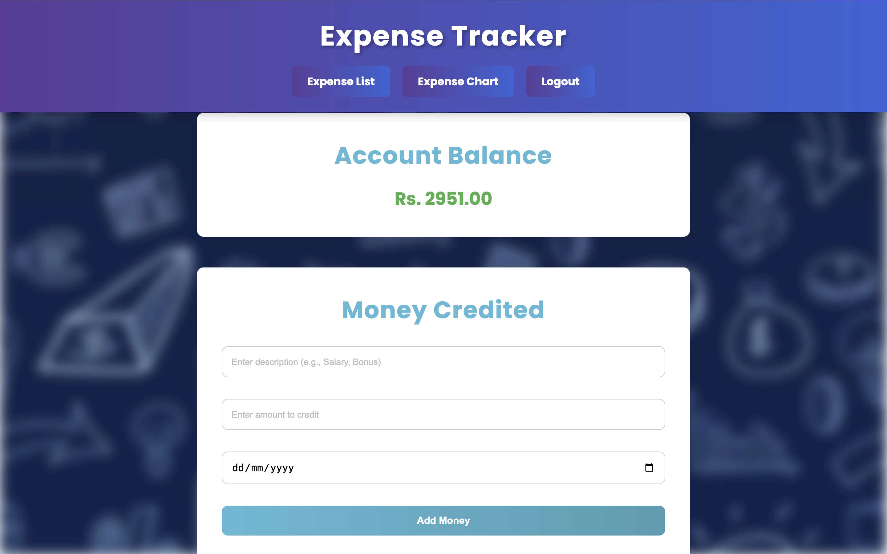
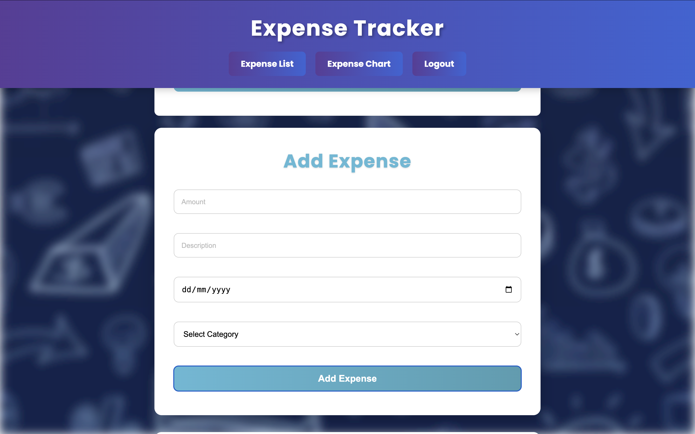
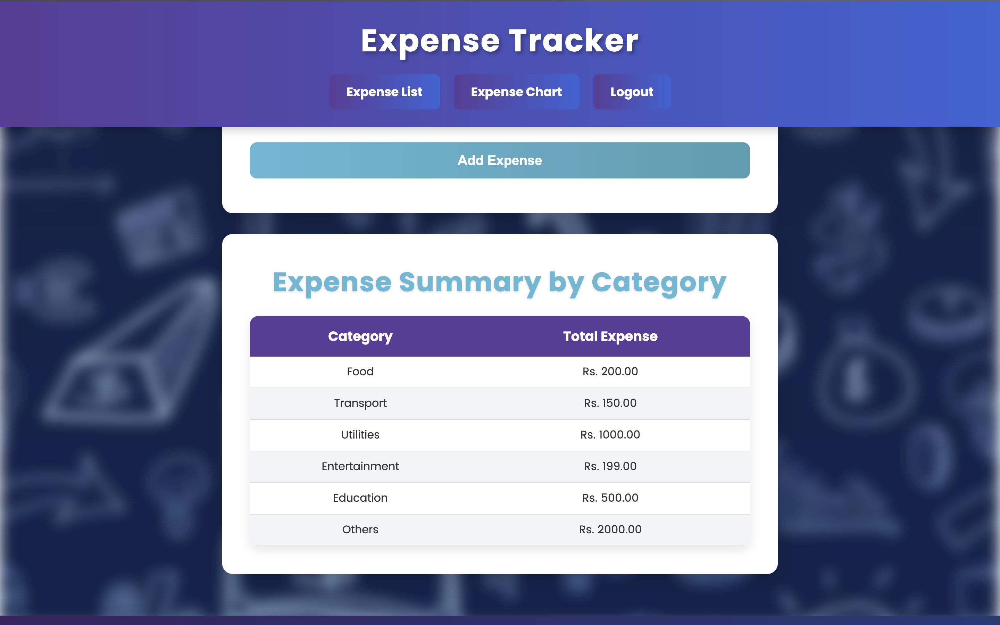

### Expense List 💼
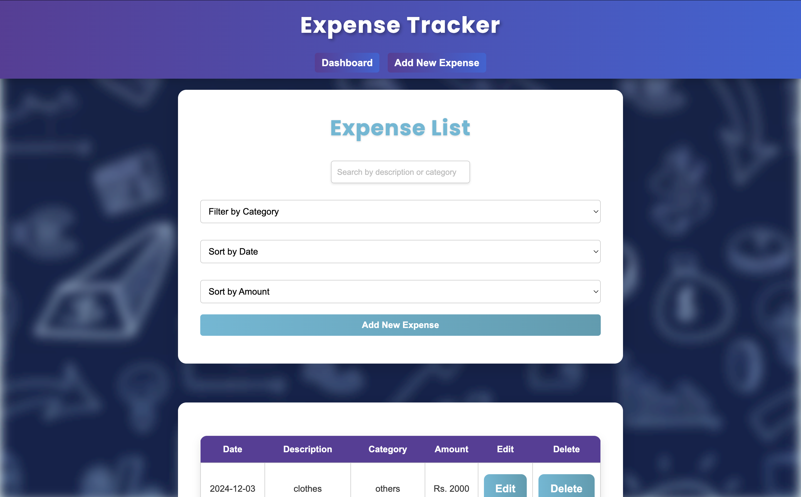
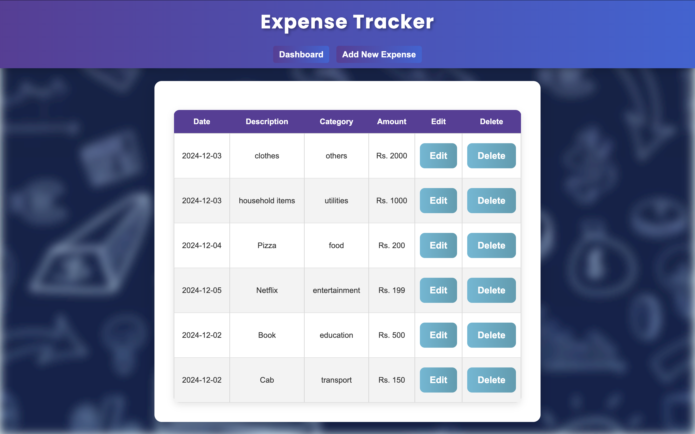
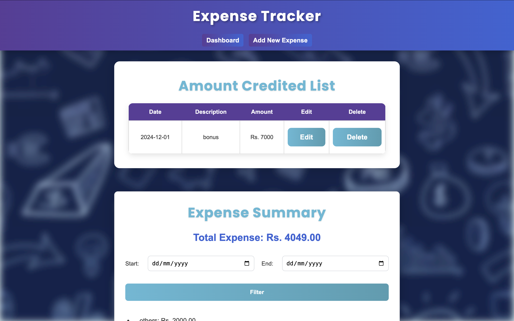
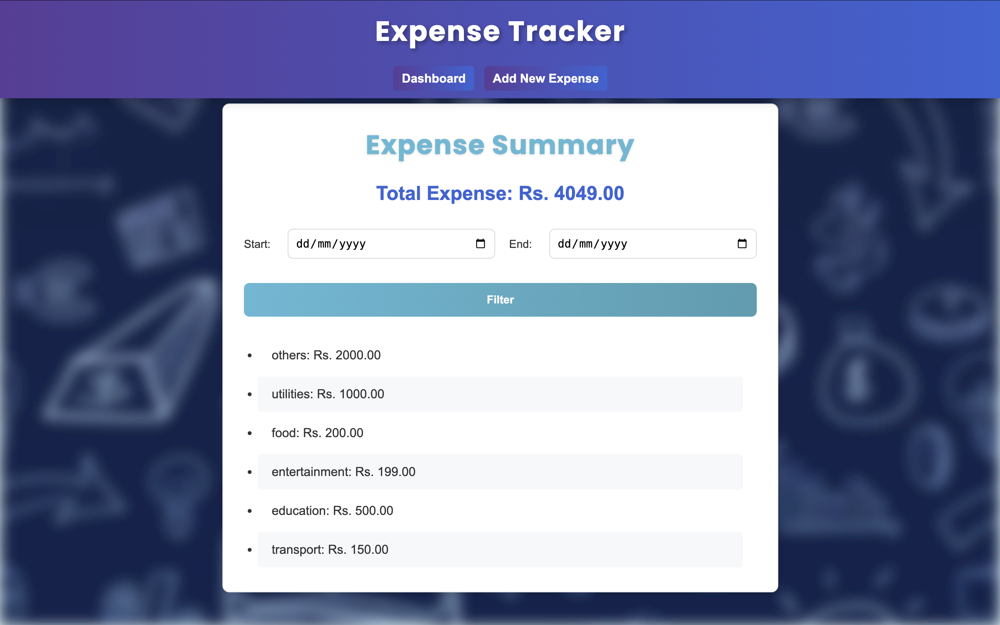

### Expense Charts 📈
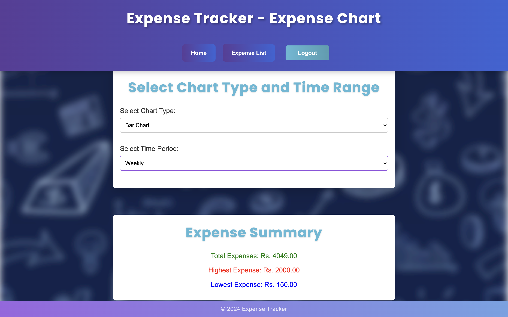
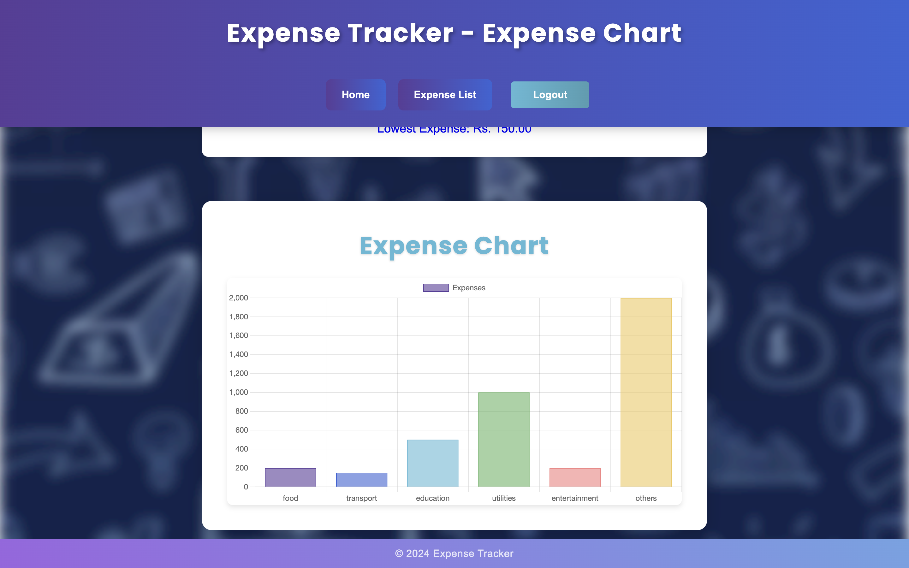
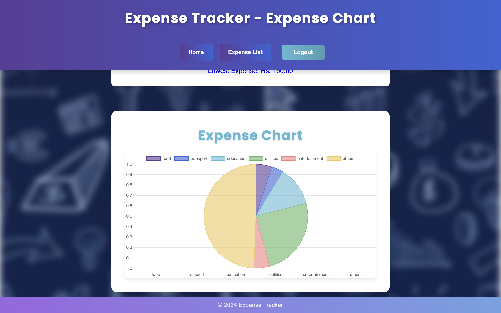

## Future Enhancements 🛠️
- Add support for exporting expense data as CSV or Excel files.
- Implement a dark mode for better user experience.
- Integrate notifications for budget alerts.
- Allow users to upload receipts for each expense.

## Owners 👩‍💻
- **Namita Singh**
- **Amisha Gupta**

